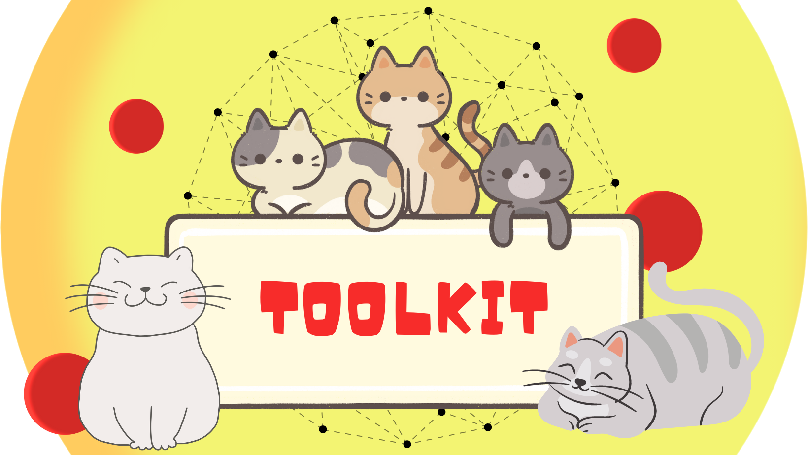

# Toolkit

[](https://github.com/geirolz/toolkit/actions)
[](https://codecov.io/gh/geirolz/toolkit)
[](https://www.codacy.com/manual/david.geirola/toolkit?utm_source=github.com&amp;utm_medium=referral&amp;utm_content=geirolz/toolkit&amp;utm_campaign=Badge_Grade)
[](https://mvnrepository.com/artifact/com.github.geirolz/toolkit)
[](https://scala-steward.org)
[](https://mergify.io)
[](https://github.com/geirolz/toolkit/blob/main/LICENSE)

<div style="text-align:center">
 
</div>

A small toolkit to build functional app with managed resources

Please, drop a ⭐️ if you are interested in this project and you want to support it

## Getting Started

```sbt
libraryDependencies += "com.github.geirolz" %% "toolkit" % "0.0.9"
```

Check the full example [here](https://github.com/geirolz/toolkit/tree/main/example)

- `dependsOn` let you define the app dependencies expressed by a `Resource[F, DEPENDENCIES]`
- `provideOne` let you define the app logic expressed by an `F[?]`
- `provide` let you define the app provided services expressed by a `List[F[?]]` which will be run in parallel
- `provideF` let you define the app provided services expressed by a `F[List[F[?]]]` which will be run in parallel

Given

```scala
import cats.Show
import cats.effect.{Resource, IO}
import com.geirolz.app.toolkit.{App, SimpleAppInfo}
import com.geirolz.app.toolkit.logger.ToolkitLogger
import com.geirolz.app.toolkit.novalues.NoResources

// Define config
case class Config(host: String, port: Int)

object Config {
  implicit val show: Show[Config] = Show.fromToString
}

// Define service dependencies
case class AppDependencyServices(kafkaConsumer: KafkaConsumer[IO])

object AppDependencyServices {
  def resource(res: App.Resources[SimpleAppInfo[String], ToolkitLogger[IO], Config, NoResources]): Resource[IO, AppDependencyServices] =
    Resource.pure(AppDependencyServices(KafkaConsumer.fake))
}

// A stubbed kafka consumer
trait KafkaConsumer[F[_]] {
  def consumeFrom(name: String): fs2.Stream[F, KafkaConsumer.KafkaRecord]
}

object KafkaConsumer {

  import scala.concurrent.duration.DurationInt

  case class KafkaRecord(value: String)

  def fake: KafkaConsumer[IO] =
    (name: String) =>
      fs2.Stream
        .eval(IO.randomUUID.map(t => KafkaRecord(t.toString)).flatTap(_ => IO.sleep(5.seconds)))
        .repeat
}
```

You can write your app as

```scala
import cats.effect.{ExitCode, IO, IOApp}
import com.geirolz.app.toolkit.{App, SimpleAppInfo}
import com.geirolz.app.toolkit.logger.ToolkitLogger

object Main extends IOApp {
  override def run(args: List[String]): IO[ExitCode] =
    App[IO]
      .withInfo(
        SimpleAppInfo.string(
          name = "toolkit",
          version = "0.0.1",
          scalaVersion = "2.13.10",
          sbtVersion = "1.8.0"
        )
      )
      .withLogger(ToolkitLogger.console[IO](_))
      .withConfigLoader(_ => IO.pure(Config("localhost", 8080)))
      .dependsOn(AppDependencyServices.resource(_))
      .beforeProviding(_.logger.info("CUSTOM PRE-PROVIDING"))
      .provideOne(deps =>
        // Kafka consumer
        deps.dependencies.kafkaConsumer
          .consumeFrom("test-topic")
          .evalTap(record => deps.logger.info(s"Received record $record"))
          .compile
          .drain
      )
      .onFinalize(_.logger.info("CUSTOM END"))
      .run(args)
}
```

## Integrations

### [pureconfig](https://github.com/pureconfig/pureconfig)

```sbt
libraryDependencies += "com.github.geirolz" %% "toolkit-pureconfig" % "0.0.9"
```

Import the loader

```scala
import com.geirolz.app.toolkit.config.pureconfig.*
```

Which allows you to use `withConfigLoader` with `pureconfigLoader[F, CONF]` to load the config from
a `ConfigSource.default` or other sources

```scala
import cats.Show
import cats.effect.IO
import com.geirolz.app.toolkit.{App, SimpleAppInfo}
import com.geirolz.app.toolkit.config.pureconfig.*

case class TestConfig(value: String)

object TestConfig {
  implicit val show: Show[TestConfig] = Show.fromToString
  implicit val configReader: pureconfig.ConfigReader[TestConfig] =
    pureconfig.ConfigReader.forProduct1("value")(TestConfig.apply)
}

App[IO]
  .withInfo(
    SimpleAppInfo.string(
      name = "toolkit",
      version = "0.0.1",
      scalaVersion = "2.13.10",
      sbtVersion = "1.8.0"
    )
  )
  .withConfigLoader(pureconfigLoader[IO, TestConfig])
  .withoutDependencies
  .provideOne(_ => IO.unit)
  .run_
```

### [log4cats](https://github.com/typelevel/log4cats)

```sbt
libraryDependencies += "com.github.geirolz" %% "toolkit-log4cats" % "0.0.9"
```

### [odin](https://github.com/valskalla/odin)

```sbt
libraryDependencies += "com.github.geirolz" %% "toolkit-odin" % "0.0.9"
```

### [fly4s](https://github.com/geirolz/fly4s)

```sbt
libraryDependencies += "com.github.geirolz" %% "toolkit-fly4s" % "0.0.9"
```

Import the tasks

```scala
import com.geirolz.app.toolkit.fly4s.*
```

Which allows you to use `beforeProvidingMigrateDatabaseWithConfig` on `App` to migrate the database before running the
app.
To have access to the whole app dependencies you can use `beforeProvidingMigrateDatabaseWith` instead while to have
access to
the whole app dependencies to provide a custom `Fly4s` instance you can use `beforeProvidingMigrateDatabase`.

```scala
import cats.Show
import cats.effect.IO
import com.geirolz.app.toolkit.fly4s.*
import com.geirolz.app.toolkit.{App, SimpleAppInfo}

case class TestConfig(dbUrl: String, dbUser: Option[String], dbPassword: Option[Array[Char]])

object TestConfig {
  implicit val show: Show[TestConfig] = Show.fromToString
}

App[IO]
  .withInfo(
    SimpleAppInfo.string(
      name = "toolkit",
      version = "0.0.1",
      scalaVersion = "2.13.10",
      sbtVersion = "1.8.0"
    )
  )
  .withConfig(
    TestConfig(
      dbUrl = "jdbc:postgresql://localhost:5432/toolkit",
      dbUser = Some("postgres"),
      dbPassword = Some("postgres".toCharArray)
    )
  )
  .withoutDependencies
  .beforeProviding(
    migrateDatabaseWithConfig(
      url = _.dbUrl,
      user = _.dbUser,
      password = _.dbPassword
    )
  )
  .provideOne(_ => IO.unit)
  .run_
```